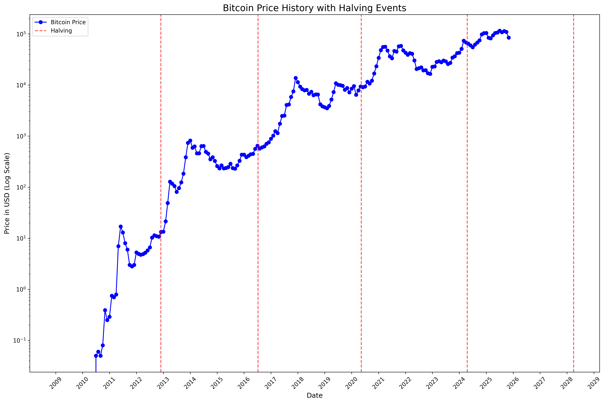
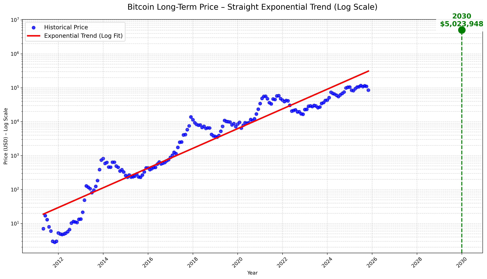

# Bitcoin Price Analysis – Halving Cycles & Power-Law Trend

Simple, clean Python scripts that visualize Bitcoin’s price history and long-term growth using real monthly data.

All charts are generated from a single CSV file: **`bitcoin_monthly_prices.csv`**

## Generated Charts

### Bitcoin Halving Cycle Chart
Monthly price on log scale with every Bitcoin halving marked  


### Bitcoin Power-Law Trend (Log-Linear Regression)
Straight red line = true long-term exponential / power-law growth  
2030 prediction: **~$5–6 million** (depending on exact filtering)



## Scripts

| File                          | What it does                                                                 |
|-------------------------------|-------------------------------------------------------------------------------|
| `btc_halving_cycle_chart.py`  | Plots price history (log scale) + vertical lines at each halving              |
| `btc_power_law_trend.py`      | Fits log-linear regression → straight trend on log scale + 2030 extrapolation |

## Quick Start

```bash
python -m venv .venv
source .venv/bin/activate
pip install pandas matplotlib scikit-learn

# Generate the charts
python btc_halving_cycle_chart.py
python btc_power_law_trend.py