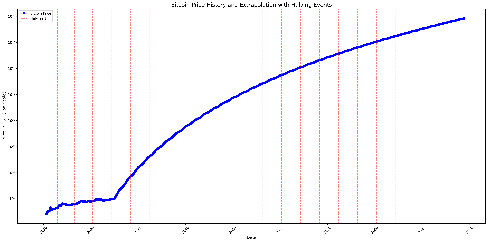
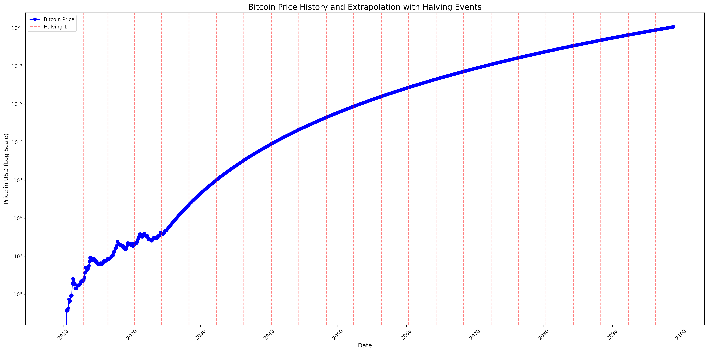
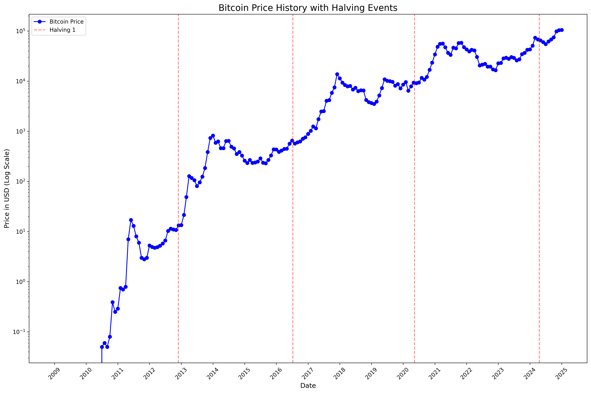
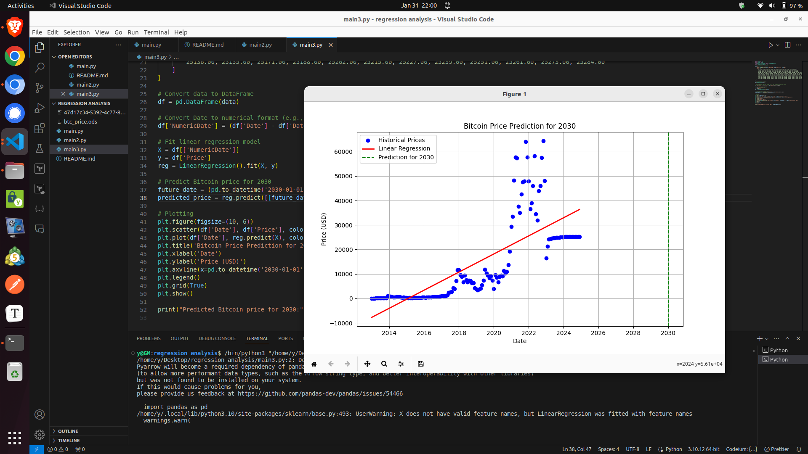

```
python -m venv .venv
source .venv/bin/activate
pip3 install matplotlib pandas sklearn 
pip3 install -U scikit-learn scipy matplotlib
pip3 install scikit-learn


pip3 freeze > requirements.txt
pip install -r requirements.txt

```


### bitcoin_price_history_extrapolated_v2



### bitcoin_price_history_extrapolated_v1




### bitcoin_price_history_v1



### bitcoin_regression_v1




Thanks to https://x.com/i/grok,  https://pi.ai/talk and https://chat.openai.com/ 3.5
